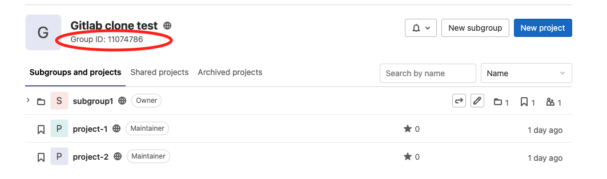

# Gitlab-Advance-Search
Due to Gitlab Advance Search need to upgrade to Gitlab EE which cost $228 USD per user per year, this repo provide a optional solution to do gitlab advance search by group.

## Prerequisites
1. brew install git
2. brew install jq
3. brew install curl
4. gitlab access token [doc](https://docs.gitlab.com/ee/user/profile/personal_access_tokens.html#create-a-personal-access-token)
5. gitlab group id

## Usage
1. Download all repo in group. 
`bash curl-all-repo.sh -t {GITLAB_ACCESS_TOKEN} -d {GITLAB_DOMAIN} -g {GITLAB_GROUP_ID} -b {GIT_BRANCH}`

2. Search keyword. 
`grep -nr -i "{KEYWORD}" ./gitlab-{GITLAB_GROUP_ID}-{GIT_BRANCH}/*`
